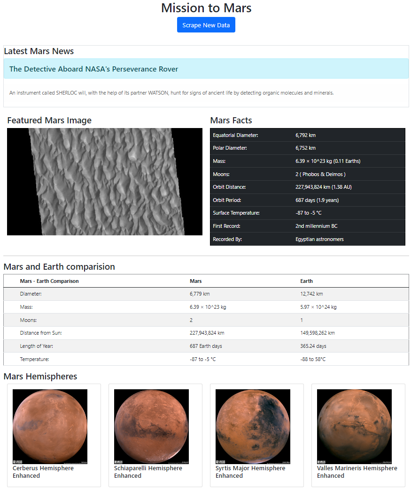

# Web Scraping - Mission to Mars

Screenshot of the final app:

In this assignment, I built a web application that scrapes various websites for data related to the Mission to Mars and displays the information in a single HTML page. The following outlines what I have done.

- - -
# The completed tasks:
##  Scraping data from external web pages

Initial scraping task were completed using Jupyter Notebook, BeautifulSoup, Pandas, and Requests/Splinter.

#### NASA Mars News

* Scrape the [Mars News Site](https://redplanetscience.com/) and collect the latest News Title and Paragraph Text. 

#### JPL Mars Space Images - Featured Image

* Visit the url for the [Featured Space Image site](https://spaceimages-mars.com).

* Use splinter to navigate the site and find the image url for the current Featured Mars Image and assign the url string to a variable.

#### Mars Facts

* Visit the [Mars Facts webpage](https://galaxyfacts-mars.com) and use Pandas to scrape the table containing facts about the planet including Diameter, Mass, etc.

* Use Pandas to convert the data to a HTML table string.

#### Mars Hemispheres

* Visit the [astrogeology site](https://marshemispheres.com/) to obtain high resolution images for each of Mar's hemispheres.

* Click each of the links to the hemispheres in order to find the image url to the full resolution image.

* Save both the image url string for the full resolution hemisphere image

* Append the dictionary with the image url string and the hemisphere title to a list. This list will contain one dictionary for each hemisphere.
 

##  Using MongoDB to achieve data and Flask Application to render web page

Use MongoDB with Flask templating to create a new HTML page that displays all of the information that was scraped from the URLs above.

* a Jupyter Notebook file called [mission_to_mars.ipynb](Missions_to_Mars\mission_to_mars.ipynb) and use this to test and complete all of scraping and analysis tasks.

* Next, create a route called `/scrape` that will import [scrape_mars.py](Missions_to_Mars\scrapper_mars.py) script and call the `scrape` function.

* Store the return value in Mongo as a Python dictionary.

* Create a root route `/` that will query Mongo database and pass the Mars data into an HTML template to display the data.

* Create a template HTML file called [index.html](Missions_to_Mars\templates\index.html) that will take the Mars data dictionary and display all of the data in the appropriate HTML elements. 

* Use Bootstrap to structure the HTML template.

- - -
# How to run this web application?
 1. Fork this repository to your local computer
 2. Run [app.py](Missions_to_Mars\app.py) using python or flask in Terminal
